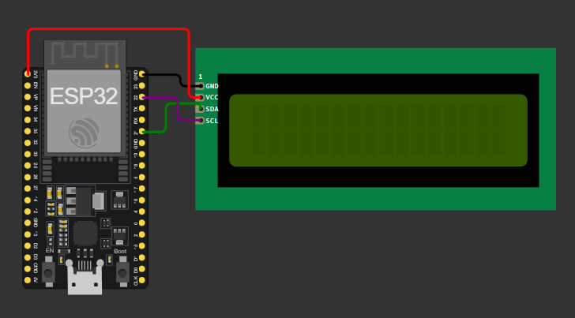
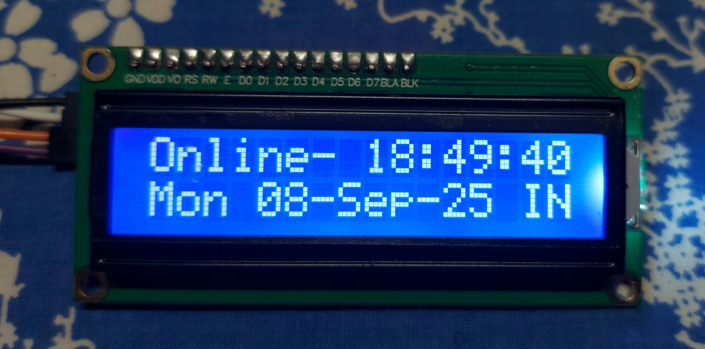

[](https://github.com/topics/ntp-clock)


# ESP32 NTP IST Clock 

An **ESP32-based Internet-synced clock** that connects to WiFi, fetches real-time from [pool.ntp.org](https://www.ntppool.org/), and displays it on a **16×2 I²C LCD**.
The clock is configured for **Indian Standard Time (IST, UTC+5:30)** and always stays accurate without manual adjustments.

---

## 📌 Features

* 🌐 **WiFi Connectivity** – auto connects and syncs time from NTP servers
* ⏳ **Real-Time Updates** – shows time in `HH:MM:SS` format
* 📅 **Date + Day Display** – formatted as `Mon 08-Sep25 IN`
* 🔋 **Always Accurate** – no drift, synced with internet
* 🖥️ **16×2 I²C LCD** for compact display

---

## 🛠️ Components Used

* ESP32 Dev Board
* 16×2 I²C LCD module (0x27 address)
* Jumper wires
* Breadboard / PCB

---

## 🔌 Circuit Connections

| ESP32 Pin | LCD (I²C) |
| --------- | --------- |
| 3.3V / 5V | VCC       |
| GND       | GND       |
| GPIO 21   | SDA       |
| GPIO 22   | SCL       |

*(Default I²C pins on ESP32: `GPIO 21 = SDA`, `GPIO 22 = SCL`)*



---

## 💻 Code

The ESP32 fetches time from NTP, applies **UTC+5:30 offset** for IST, and displays:

* First row → Time (`HH:MM:SS`)
* Second row → Date + Day (`Mon 08-Sep25 IST`)
* Open the `.ino` file in Arduino IDE

---

## 📸 Output

Sample LCD Display:

```
Online   18:45:12
Mon 08-Sep-25 IN
```

---

## 📸 Demo

[Linked In](link)

---
## 🚀 Future Improvements

* Add **DS3231 RTC backup** for offline timekeeping
* Implement **auto brightness control**
* Add **scrolling text** for full weekday/month names

---

## 🔖 License

This project is open-source under the MIT License.

---
